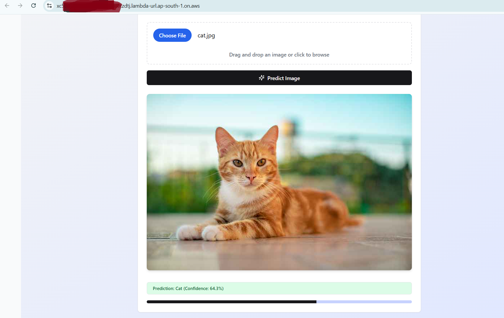
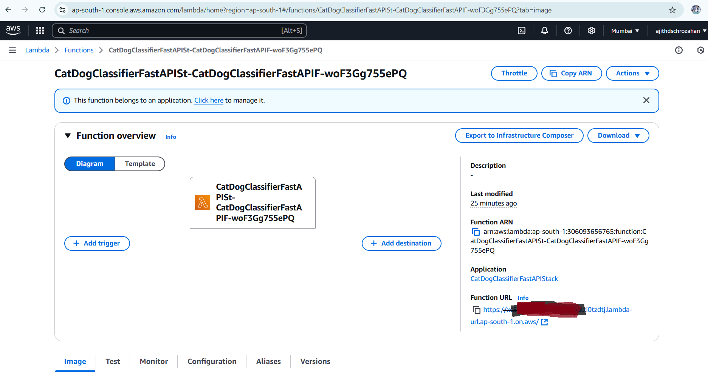
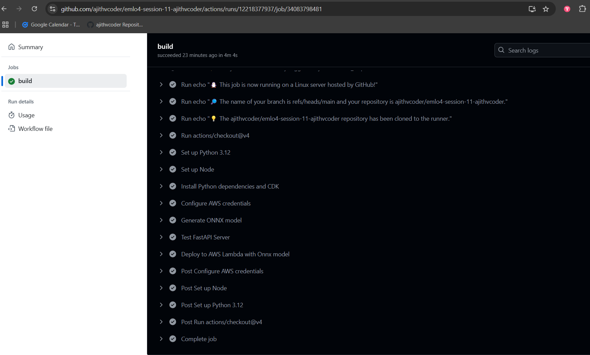

## EMLOV4-Session-11 Assignment -Deployment w/ Serverless

### Contents

- [Requirements](#requirements)
- [Development Method](#development-method)
    - [AWS CDK Integration](#aws-cdk-integration)
    - [Github Actions Pipeline](#github-actions-pipeline)
- [Learnings](#learnings)
- [Results Screenshots](#results-screenshots)

### Requirements

- Create a CI/CD Pipeline to deploy/update the model to AWS Lambda
- Submit the deployed function URL

### Development Method

**Installations**

```
    # aws cli
    curl "https://awscli.amazonaws.com/awscli-exe-linux-x86_64.zip" -o "awscliv2.zip"
    unzip awscliv2.zip
    sudo ./aws/install

    # python requirements
    pip install -r requirements-dev.txt
    pip install -r requirements.txt

    # aws-cdk cli
    npm install -g aws-cdk
```

**Build Command**

- `python3 export_onnx.py`

**Deploy locally**

- `uvicorn --host 0.0.0.0 --port 8000 app:app`

**Test locally**

- `pytest test.py`

**Docker test**

- `docker build -t fastapi-classifier .`

- `docker run -p 8000:8000 fastapi-classifier`

**CDK Usage**

- `cdk bootstrap`

- `cdk deploy --require-approval=never`

- `cdk destroy`

**Debug Command**

In case if you have deleted aws lambda function manually in UI, use below to clean completely else it would throw error while deploying agan

`aws cloudformation delete-stack --stack-name CatDogClassifierFastAPIStack`

### AWS CDK Integration

- In cdk.py file `CatDogClassifierFastAPIStack` class is used to fetch a `Dockerfile` and create a container like service with aws lambda service.
- While developing in local make sure that you have set all the environment variables
    - `aws configure`  -> `AWS_ACCESS_KEY`, `AWS_SECRET_KEY`, `AWS_REGION`
    - `CDK_DEFAULT_ACCOUNT`, `CDK_DEFAULT_REGION`
- After running `cdk bootstrap` command is used to set up the necessary AWS resources that AWS CDK needs to deploy your infrastructure. It prepares your AWS environment for the first time deployment or when you need to deploy infrastructure that requires certain resources like storing docker image, I am roles, CloudFormation.
- `cdk deploy` - Deploys your infrastructure to AWS as defined by your CDK stack.
- `cdk destroy` - Destroy all resources created about without any traces left.

### Github Actions Pipeline

- Configure the following env variables in github secrets

    - `AWS_ACCESS_KEY`, `AWS_SECRET_KEY`, `AWS_REGION`
    - `CDK_DEFAULT_ACCOUNT`, `CDK_DEFAULT_REGION`

- Use `actions/checkout@v4`, `actions/setup-python@v5`, `actions/setup-node@v4` to checkout the code, install python env and node.

- Export the onnx model from torch script and use cdk to deploy the fast api service to serveless lambda service

### Learnings

- Use AWS CDK and create AWS cloud resources programatically.

### Results Screenshots

**Deployed URL**







**CI CD run**

- Run [here](https://github.com/ajithvcoder/emlo4-session-11-ajithvcoder/actions/runs/12218377937/job/34083798481)





### Group Members

1. Ajith Kumar V (myself)
2. Pravin Sagar
3. Pratyush

